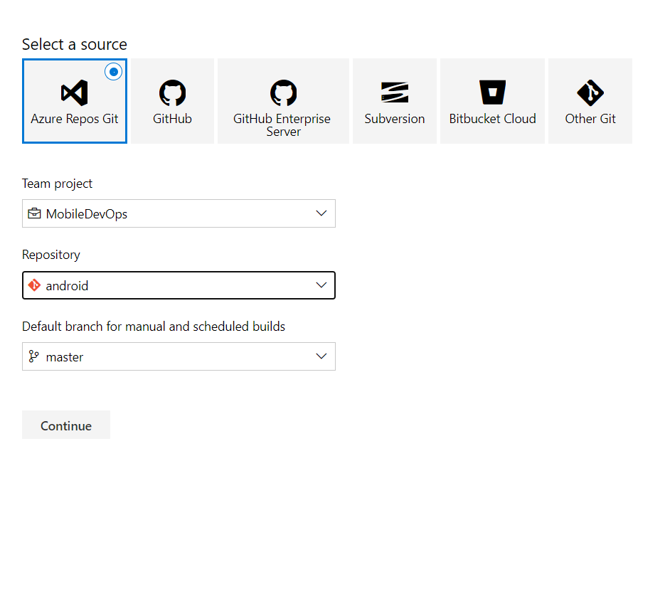
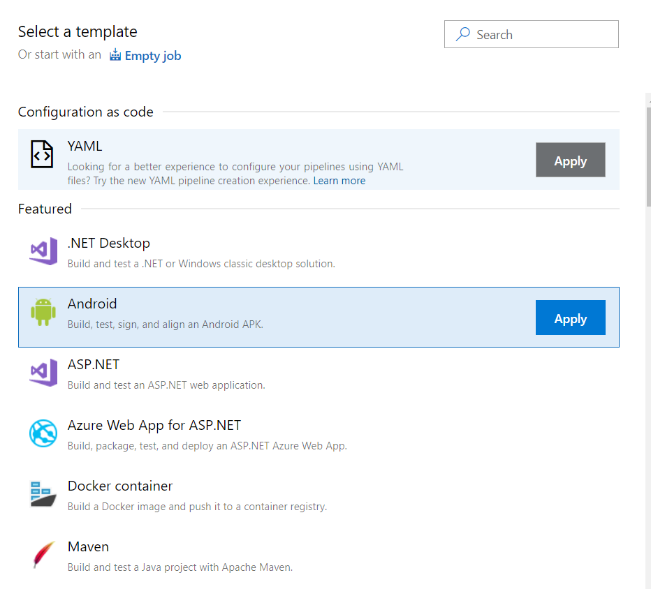
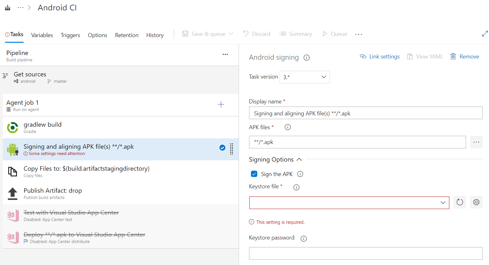
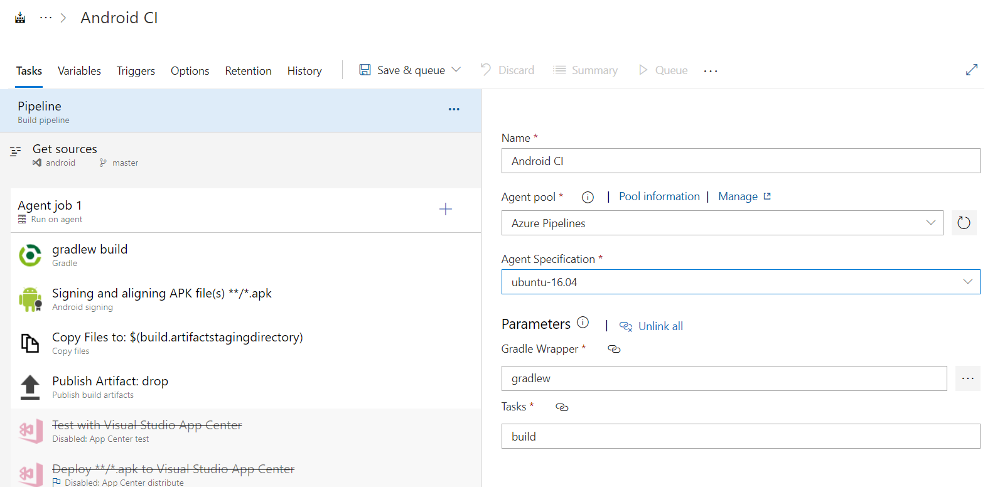
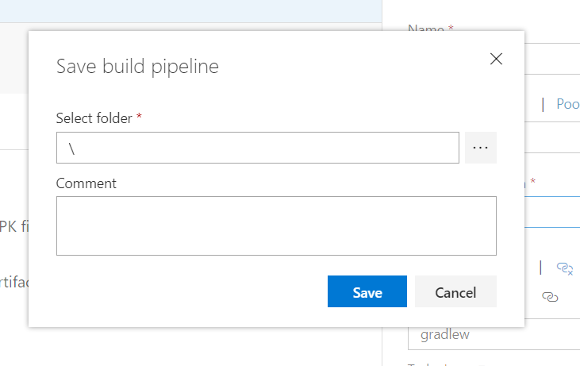
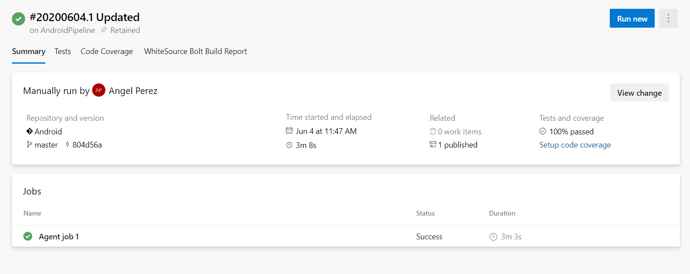

# Welcome
This file contains examples to create CI experiences for Android target.

The first task is upload our android repository if we want to keep track inside Azure DevOps, but we can use other sources instead.

## Continuous Integration
The first thing is connecting the repo, we can choose from different sources.

The prebuilt template for android contains all the required steps to generate a non-signed apk.

For generate a signed apk, we must provision the jks file and credentials for signing the build

The agent for running the pipeline, it will run in almost every agent, but for best result choose mac or linux distribution

Last step is save and queue pipeline

Build Results

## Continuous Delivery
Currently exist some steps, but for integrating with Official Stores we highly recommend working with AppCenter CD.
