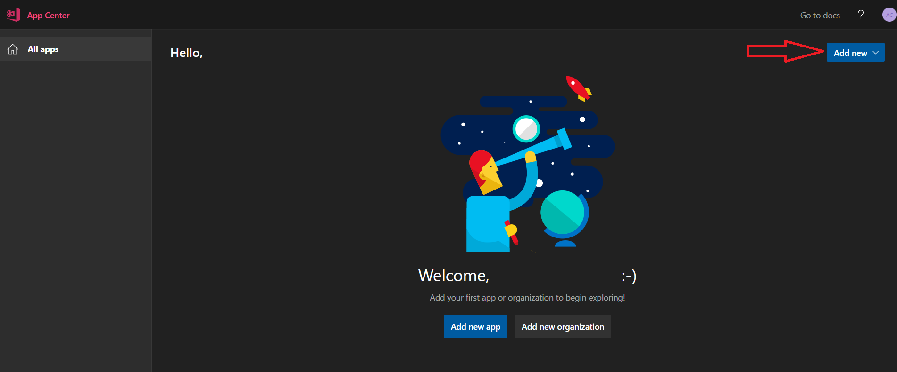
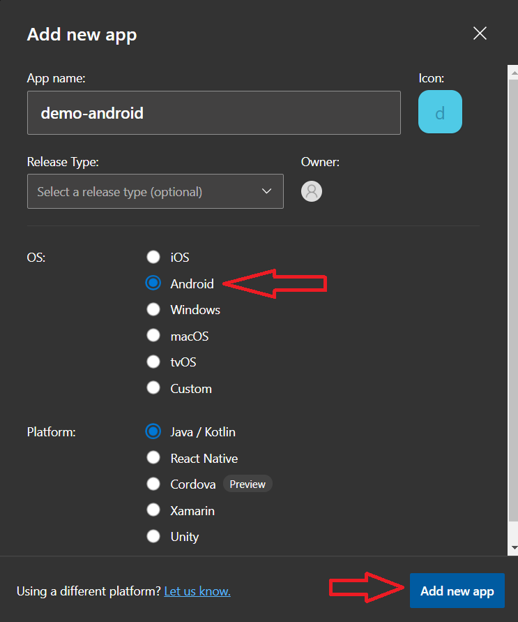
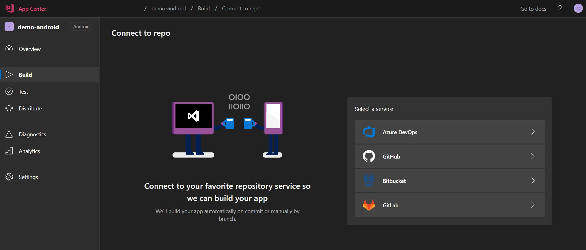
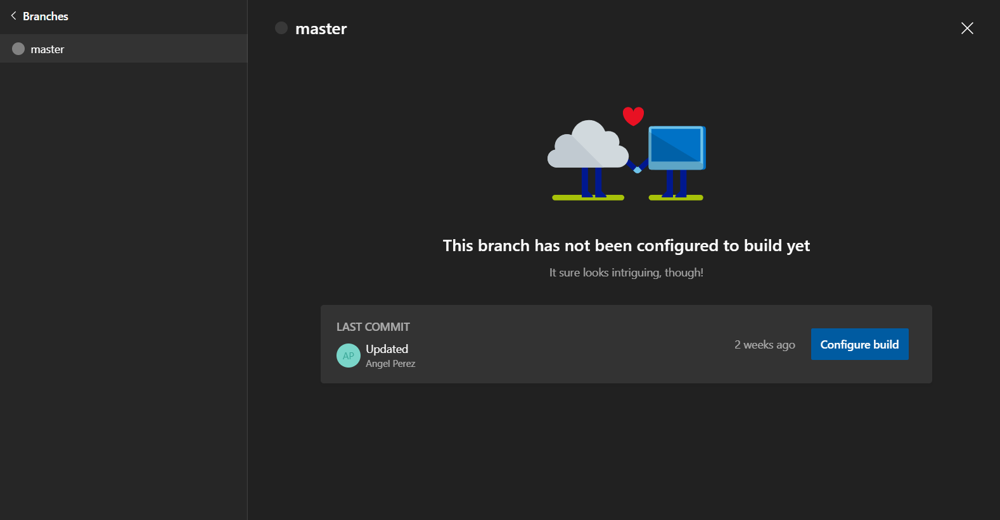
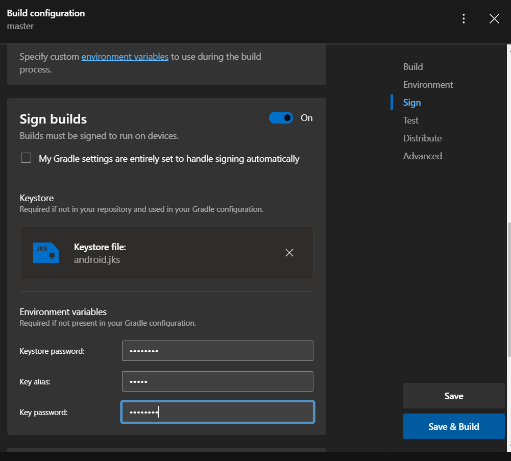
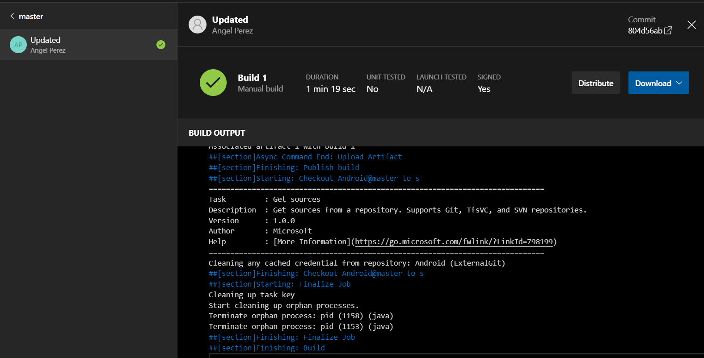
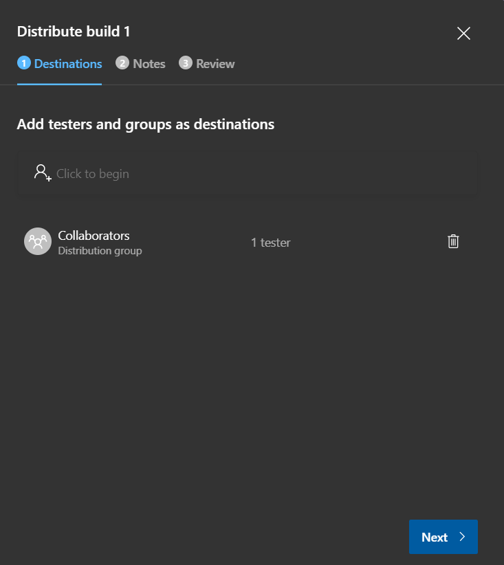

# Welcome
This file contains examples to create CI/CD experiences for Android target.

The first task is upload our android repository if we want to keep track inside Azure DevOps, but we can use other sources instead.

## Continuous Integration
When we create a new project, is required to specify what is going to be the target OS and the base technology, we can change it later.

The first thing is connecting the repo, we can choose from different sources.

Once the connection is completed, we can choose from the different branches to configure a build pipeline.

For generate a signed apk, we must provision the jks file and credentials for signing the build

Last step is save and queue pipeline and check results

## Continuous Delivery
For accomplish this task, we can distribute using AppCenter mechanism for sending to a group or groups and connect to store
