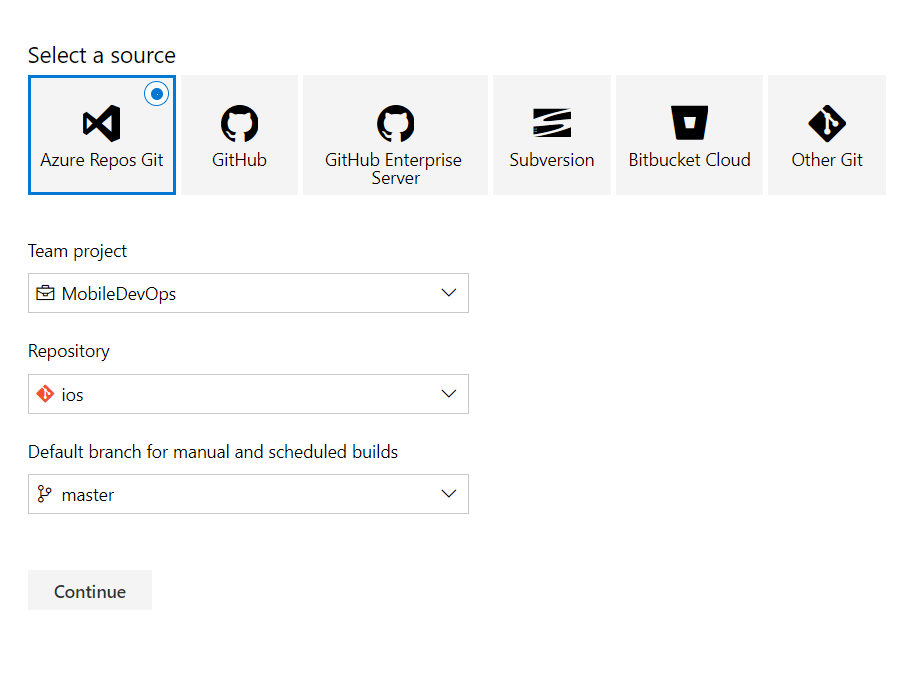
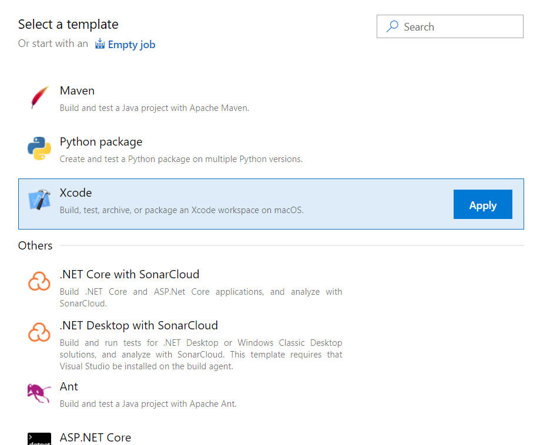
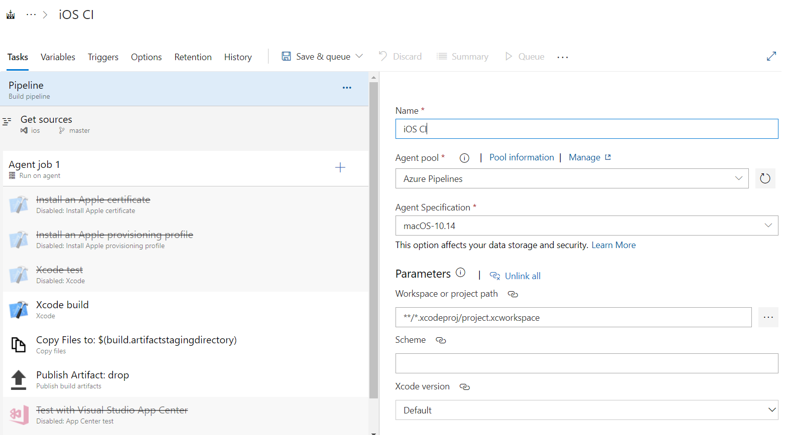
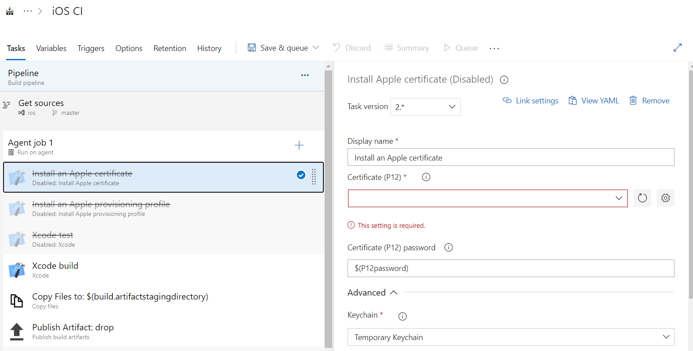
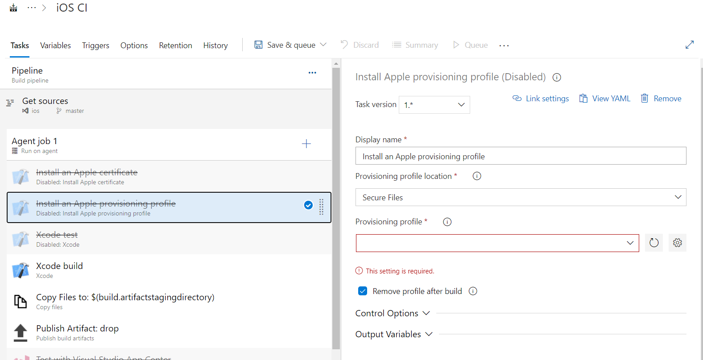
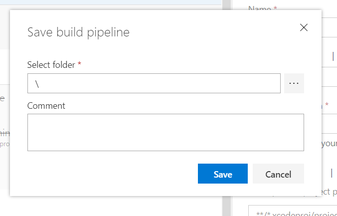

# Welcome
This file contains examples to create CI experiences for iOS target.

The first task is upload our iOS repository if we want to keep track inside Azure DevOps, but we can use other sources instead.

## Continuous Integration
The first thing is connecting the repo, we can choose from different sources.

The prebuilt template for iOS contains all the required steps to generate a non-signed bundle to deploy in simulator.

The agent for running the pipeline choose mac distribution.

For generate a signed apk, we must provision the p12 certificate file and provisioning profile for signing the build.

Last step is save and queue pipeline

## Continuous Delivery
Currently exist some steps, but for integrating with Official Stores we highly recommend working with AppCenter CD.
